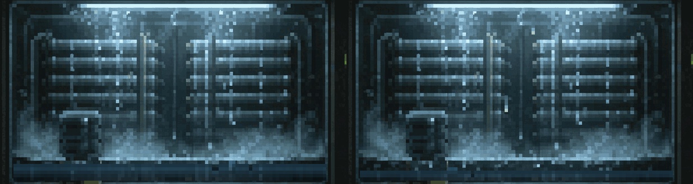

# COND-07: game-owned water, fog and lamps

Two independently controlled condenser units use production `WaterShader`,
`FogShader`, `LampShader`, and `MistShader` components and the generic shader-material API.
Contained water is still between drop impacts: no travelling wave or reflection
flow. At `water_level = 1.0` the top edge is the brim: the impact displacement
is clamped to the downward side, so crests rest on the brim, troughs dip below
it, and the mask's top row never goes dry. Fog and light replace their contributions in the static art; they do not
lay a second haze over the original plate.



## Dependencies

`project.labelle` pins the released game-shader-material stack: core 2.0.0,
gfx 2.0.0, engine 3.0.0 and the bgfx backend 0.21.0 (the first contract-v2
backend; it requires core >= 2.0.0, so the four pins move together). Only the
assembler is still selected as `local:../../`, like every example in this
repository. To develop against unreleased sibling checkouts instead, switch the
four pins to `local:../../../labelle-{core,gfx,engine,bgfx}` and regenerate.

```sh
# POSIX. `labelle build` from this directory does the same thing.
../../zig-out/bin/labelle-assembler generate --project-root .
( cd .labelle/bgfx_desktop && zig build && zig build test --summary all )
```

```powershell
../../zig-out/bin/labelle-assembler.exe generate --project-root .
Push-Location .labelle/bgfx_desktop
zig build
zig build test --summary all
Pop-Location
```

The assembler owns descriptor discovery, compilation, and the generated
`@import("materials")`. Set `LABELLE_SHADERC` to a host shaderc executable when
using an existing compiler. The requested targets are SPIR-V, GLSL, ESSL and
Metal. Game code uses generated `.shaders` / `.parameters` and engine catalog
texture bindings; it never imports a graphics backend. The backend provides
`s_tex` and `u_material_rect`, including atlas remapping.

## Art and masks

PR730 artwork stays **618x330 per unit at scale 1**, in a 1236x330 window. Only
the left two columns of the authorized 620x330 `condenser-detail.gif` crop were
removed. No full-room reference is used. The original atlas/layers are retained.
Water uses a separate 93x6 logical grid (six screen pixels per cell), a 558x36
mask and a fixed supplied reflection. Fog and light use full-canvas standalone
images and an independently adjustable effect grid (default six screen pixels).

`tools/derive_effect_masks.py` decomposes the existing full-resolution layers
with a bounded inverse-over model. It produces estimated clean interior/frame
plates, a veil/lighting-response mask, and the physical lamp source mask.
This is an estimated reconstruction, not recovered original layered artwork.
The static interior recomposes within two byte values after PNG quantization.
Full-resolution structural texture and alpha boundaries remain intact; only
effect modulation snaps to cells. The emissive tube is reconstructed out of
the clean frame and restored only inside its source mask and live lamp width.

```sh
python tools/derive_layers.py
python tools/pack_atlas.py
python tools/derive_effect_masks.py
```

The cooler and frame continue to occlude the water and falling drops. Fog's
background sample never moves. Both shaders include the same
`materials/shared/lamp_footprint.sc` for exact lamp/fog coupling.

## Prefab and runtime controls

Edit `prefabs/reservoir.jsonc`, `prefabs/fog.jsonc`, and `prefabs/lamp.jsonc`.
Scene instances use partial `WaterShader`/`FogShader`/`LampShader` overrides.
Missing fields inherit; explicit `0` and `false` are retained. Tests exercise
the real engine prefab merge and deserializer, including these zero cases.

| Component | Controls and zero semantics |
|---|---|
| WaterShader | `water_level` 0..1; `reflection_opacity` 0..1; positive `ripple_duration_seconds` and `ripple_radius_pixels`; nonnegative `ripple_strength_pixels`; logical size/grid, colors, mask/reflection catalog keys. Zero fill clears impacts. |
| FogShader | `density` changes optical depth; `opacity` separately fades its result (0..1). Either zero removes the veil. `variation` controls contrast, `wisp_size` the spatial wavelength (screen px; zero removes variation), `turbulence` blends a second evolving octave (0..1). |
| FogShader motion | `speed` scales all motion; zero freezes it. Signed `drift_velocity: [x,y]` gives direction and rate in screen px/s before speed scaling; `[0,0]` disables translation. `light_coupling` controls scattering, zero removes coupling. Color/grid are independent controls. |
| LampShader | `center`, `width`, `reach_up`, `reach_down` in screen px. Zero width/intensity disables source and halo; a zero reach disables only that side of the halo. |
| LampShader shape | `spread` expands the halo away from the source; `softness` feathers horizontal edges (zero is hard); `falloff` is a vertical exponent (zero is flat inside the bounded reach); `glow` scales halo only (zero keeps the physical tube). |
| LampShader animation | `flicker` amplitude 0..1 (default zero, constant lamp); `flicker_speed` cycles/s (zero freezes phase). Flicker is deterministic, bounded and shared with fog scattering. Color/grid and `enabled` remain editable. |

Simulation clocks wrap/rebase without wall-clock dependence. Water owns eight
bounded impacts, expires them permanently, drops impacts when bounds shrink,
rejects nonfinite/malformed state, and replaces the oldest impact deterministically.
Drops read the live level and emit once on contact. Refill cannot resurrect an
old ripple. Invalid optional-field water patches leave prior state intact.

Keyboard controls affect **unit A only**:

- **Space**: switch fill level; **R**: inject a demonstration impact.
- **F**: toggle fog; **L**: toggle lamp; **M**: toggle mist.
- **Q/E**: decrease/increase lamp width by 12 px.
- **S/W**: decrease/increase upward reach by 6 px.
- **A/D**: decrease/increase downward reach by 12 px.
- **G**: alternate the default lamp and width=120/up=0/down=66 preset.

Startup environment overrides apply to both units. Numeric zero is a real value.
All use the `CONDENSER_` prefix:

- `WATER_LEVEL`, `WATER_OFF`, `WATER_RIPPLE_STRENGTH` (zero renders exactly
  like no impacts at all).
- `WATER_SHADER_RIPPLE_DURATION` is a shader-uniform verification hook, not a
  component control: it uploads every live impact at age zero with that raw
  duration, the one state this example cannot otherwise produce (`validate()`
  refuses a nonpositive duration, and impacts are emitted before `advance()`
  here). It exists for `tools/verify_water_edges.py`.
- `FOG_DENSITY`, `FOG_OPACITY`, `FOG_SPEED`, `FOG_VARIATION`, `FOG_WISP_SIZE`,
  `FOG_TURBULENCE`, `FOG_DRIFT_X`, `FOG_DRIFT_Y`, `FOG_LIGHT`, `FOG_OFF`.
- `LAMP_WIDTH`, `LAMP_UP`, `LAMP_DOWN`, `LAMP_INTENSITY`, `LAMP_SPREAD`,
  `LAMP_SOFTNESS`, `LAMP_FALLOFF`, `LAMP_GLOW`, `LAMP_FLICKER`,
  `LAMP_FLICKER_SPEED`, `LAMP_OFF`.

`CONDENSER_TEST_CONTROL=water|fog|lamp|mist` triggers the corresponding
Space/F/G/M control path at frame 60. `CONDENSER_TEST_LEFT=1` triggers all four.
Both hooks
change only the left unit and preserve normal keyboard input. Capture at two
seconds with `LABELLE_FIXED_DT=0.016666667` for deterministic comparison.

## Verification

- `zig build test --summary all` from the generated desktop directory: **21 tests**,
  including water lifetime/bounds/rebase/invalid state, passive expiry erasing
  the retained slot, directional drift,
  zero controls, flicker, actual prefab merge, and real keyboard paths.
- `python tools/verify_effect_assets.py`: **10 checks**, including saved-mask
  reconstruction, alpha preservation, independent fog/lamp controls, shared
  grid behavior, and descriptor shapes; writes a CPU reference contact sheet.
- `tools/compile_shaders.ps1 -Shaderc <exe> -Include <bgfx-shader-directory>`:
  compiles all **16 variants** independently of the game build.
- `python tools/verify_water_edges.py`: **13 native runs** covering the water
  edge cases of issue #734 — motion and brim coverage at `water_level = 1.0`,
  and an empty ripple window contributing nothing at age zero.
- `python tools/verify_runtime.py`: **16 actual native runs** (macOS/Metal and
  Windows/Vulkan), eight live generic
  materials each, fixed-step captures, frame-60 left-only edits, zero width and
  zero fog opacity equivalence, and independent fog/lamp off cases.

Windows/Vulkan runtime checks pass. The right 618x330 half is byte-identical
across every left-control run. Results, logs and captures are under
`.test-output/runtime/`; the directory is ignored. Other shader targets compile
but have not been executed here. `preview.png` is the current native capture.

Mist verification also checks clipping above each live water surface, empty
reservoir suppression, zero opacity, moving versus frozen wisps, and a left-only
M toggle. All 16 native scenarios pass; changing the left mist changes 17,886
left pixels and zero right pixels. The captures and measurements are in
`.test-output/runtime/results.txt`.

## Floating water mist

`prefabs/mist.jsonc` configures a separate transparent `MistShader` above each
reservoir. It uses procedural wisps, without new artwork or moving background
samples. The layer sits behind drops and foreground machinery. **M** toggles
only the left mist; **Space** changes the water level and its mist anchor.

- `height`: vertical band above the water, in screen pixels; zero disables it.
- `density`, `opacity` and `color`: thickness and tint; zero density/opacity removes it.
- `drift_velocity`: signed screen pixels/second; default `[12,-3]` drifts right and rises.
  `[0,0]` freezes the pattern.
- `wisp_size`, `turbulence`, `grid_pixels`: shape, detail and pixel scale.
- `light_coupling`: response to the matching lamp; zero removes that response.

Bounds and surface height come from the matching reservoir in this example;
empty or disabled water emits no mist. Startup overrides: `CONDENSER_MIST_OFF`,
`CONDENSER_MIST_OPACITY`, `CONDENSER_MIST_FREEZE`. The deterministic runtime
hook `CONDENSER_TEST_CONTROL=mist` exercises the same M-key path at frame 60.

The probe queries actual `game.shaderMaterial(entity)` bindings. Cold catalog
loads retry silently during the first 300 frames; hard failures and prolonged
loading failures are reported. Context loss can recreate materials from the
same game components. GPU and texture lifetime cleanup remains engine-owned.
