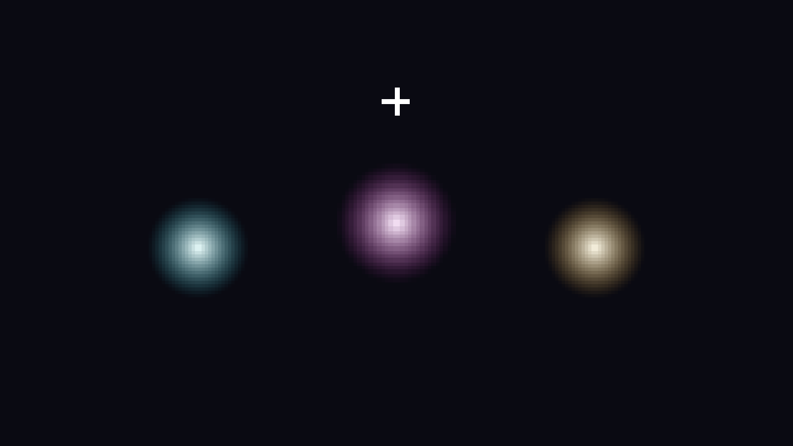

# material-demo — the post-fx set (bgfx)

Showcase game for [labelle-toolkit#611](https://github.com/labelle-toolkit/labelle-assembler/issues/611)
(`docs/showcase-plan.md`, row 9 — the entry that was deferred until
gfx#305 landed). Bright orbs bob in the dark while a full-screen post-fx
stack grades the frame.



> This still is the authored scene **before** post-fx — the orb sprites at
> their scene positions. Post-fx (bloom / vignette / color-grade / CRT) is
> a shader pass the engine applies at the framebuffer; capture the true
> post-processed frame with the **Screenshot** command below.

## What it demonstrates

The just-shipped **post-fx** half of gfx#305, on bgfx — the backend that
ships all four full-screen shader passes. The entire feature surface is
the declarative `.post_fx` block in `project.labelle`:

```zig
.post_fx = .{
    .{ .bloom       = .{ .threshold = 0.55, .intensity = 1.1, .radius = 1.0 } },
    .{ .vignette    = .{ .intensity = 0.55, .radius = 0.85, .softness = 0.45, .tint = .{ 0.02, 0.02, 0.06 } } },
    .{ .color_grade = .{ .strength = 0.35, .lut = 0 } },
    .{ .crt         = .{ .curvature = 0.08, .scanline = 0.35, .mask = 0.25, .aberration = 0.12 } },
},
```

- The assembler emits it as a `g.setPostFx(...)` seed
  (`src/codegen/blocks/post_fx.zig`), validating each pass against the
  bgfx manifest's advertised `.post_fx_passes` at generate time
  (declare a pass the backend lacks → a build-time warning, not a silent
  runtime drop).
- The engine forwards the stack to gfx's `PostFxDriver`
  (`post_fx_mixin.zig`, gated on gfx ≥ 1.28).
- bgfx `0.20.0` renders each pass from its
  `.post_fx_passes = .{ .bloom, .vignette, .color_grade, .crt }` manifest.

A tiny script (`scripts/playing/10_bob.zig`) bobs the orbs on sine paths
so their bright cores drift through the bloom threshold — the post-fx
stack itself is entirely declarative; the script only animates the
sources.

## Scope note — the two halves of gfx#305

gfx#305 shipped TWO surfaces. This demo exercises the **post-fx** half
only, wired end-to-end for games since engine 2.6.0 (the demo's original
pin). The **per-entity material** half (`palette_swap` / `flash` /
`dissolve` / `outline`) is plumbed through core + gfx
(`SpriteVisual.material`), and the engine now pinned here (`2.12.2`) does
expose `game.setMaterial(entity, material)` (`src/game/visuals.zig`) — it
was `2.6.0` that had no game-facing authoring surface for it. This demo
still does **not** drive per-entity materials; the second scene that
flashes / dissolves individual orbs is the tracked follow-up
([labelle-engine#789](https://github.com/labelle-toolkit/labelle-engine/issues/789)).

Files:

- `project.labelle` — the `.post_fx` stack (the whole feature).
- `components/orb.zig` — `Orb { amplitude, phase, … }`, the bob tag.
- `scripts/playing/10_bob.zig` — sine-path bob.
- `scenes/main.jsonc` — three hued orbs + a star, on a dark field.
- `assets/glow.{png,json}` — radial-gradient orbs + a star core.

## Version pins

The **runtime** packages + bgfx backend pin the **released** set; the
**assembler** is `local:../../` (in-tree source, the examples convention —
see the pins note in `tile-explorer/README.md`):

```zig
.core_version = "1.32.0", .engine_version = "2.12.2", .gfx_version = "1.30.1",
.labelle_version = "1.58.0", .assembler_version = "local:../../",
.backend_package = .{ .name = "bgfx", … .version = "0.20.0" },
```

> **Backend pin `0.20.0`, and the runtime trio raised with it.**
> labelle-core v1.32.0 appended `MaterialEffect.pixel_water`; every bgfx
> release before `0.20.0` switches exhaustively over that enum with no arm
> for the new tag, so it stops compiling against that core — and CI clones
> `labelle-core` at `main` as a sibling checkout that the assembler builds
> in preference to the `.core_version` pin. `0.20.0` implements the effect
> behind `@hasField(MaterialEffect, "pixel_water")` probes.
>
> The core pin follows the backend. bgfx `0.20.0` has a **hard** core floor
> of `1.28.0` (`core.BackendTextureId`, a struct field type), so the earlier
> `core_version = "1.26.0"` pairing (#731) failed a **standalone** `labelle
> build` inside the backend (`labelle-bgfx/src/gfx/types.zig:17:38: … no
> member named 'BackendTextureId'`) — CI never saw it because the sibling
> core is `main` and the bgfx games are generate-only there (#732). The pin
> is `1.32.0`, the core bgfx `0.20.0` was released against and the one the
> curated `labelle init` trio carries; the trio here is that curated set.
> `project.labelle` spells out the reasoning.

On the fully-released `labelle` path this game builds on assembler
`0.94.0` (bgfx takes the generic desktop `unifyCoreDiamond` codegen,
unaffected by the sokol-desktop gap #611 fixes).

## Build & run

```bash
labelle build          # generate → zig build, on the released pins above
labelle run --timeout=20s
```

## Screenshot

```bash
labelle run --timeout=15s --screenshot=shot.png --after=3s
```

The captured frame is the POST-processed image (the engine applies the
stack before the readback). bgfx needs a native surface — a GUI session on
macOS, or `xvfb` on a headless Linux runner.
