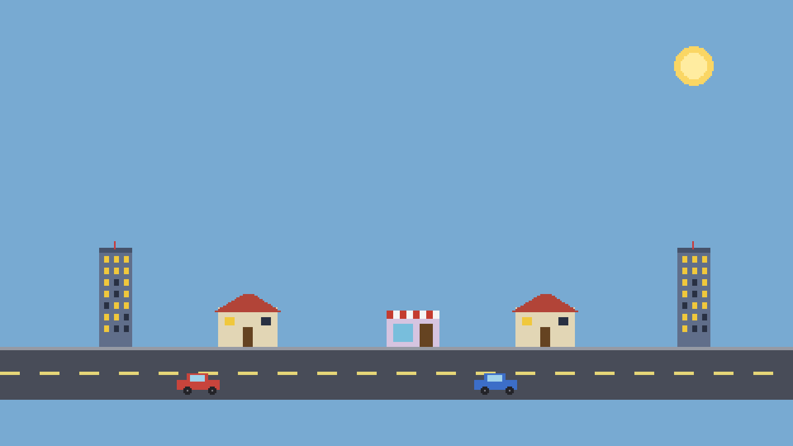

# pack-city — the packs wall as a real game (bgfx)

Showcase game for [labelle-toolkit#611](https://github.com/labelle-toolkit/labelle-assembler/issues/611)
(`docs/showcase-plan.md`, row 6). A little city street: a `buildings`
pack ships the skyline, a `traffic` pack ships the cars that drive past,
and the two cooperate ONLY across the pack wall.



> Deterministic still of the authored scene (real pack + root atlases).
> Capture the true engine frame with the **Screenshot** command below.

## What it demonstrates

The Packs convention (`docs/packs.md`) as an actual composed game — where
the `packs-demo` fixture probes the wall's guarantees headlessly, this
one renders them:

- **Two packs, each self-contained** — `packs/buildings/` ships its own
  atlas + component (`Building`) + three prefabs (`house`, `tower`,
  `shop`) + ONE exposed query (`count`). `packs/traffic/` ships the
  `Car` component, two car prefabs, and a drive script.
- **The wall** — traffic `depends_on` buildings and reaches it ONLY
  through the exposed surface: `@import("buildings").queries.count(game)`.
  Buildings' files, its `Building` component, anything not `.exposes`d — a
  compile error behind the wall.
- **Namespaced composition in the scene** — the scene places prefabs by
  their `<pack>__<prefab>` names (`buildings__tower`, `traffic__car_red`)
  next to game-root sprites (`road`, `sun` from the `city` atlas).
  Referencing a pack prefab auto-wires that pack's atlas into the scene
  (assembler#579) — scenes are data; the wall does nothing to them.

Files:

- `packs/buildings/` — `pack.labelle` (`.exposes = .{ .queries = .{"count"} }`),
  `components/building.zig`, `queries.zig`, `prefabs/{house,tower,shop}.jsonc`,
  `assets/buildings.{png,json}`.
- `packs/traffic/` — `pack.labelle` (`.depends_on = .{"buildings"}`),
  `components/car.zig`, `prefabs/car_{red,blue}.jsonc`,
  `scripts/playing/20_drive.zig` (the cross-pack call), `assets/traffic.{png,json}`.
- `scenes/main.jsonc` — composes both packs + the root `city` atlas.

The drive script logs the cross-pack result once —
`[city] buildings standing: 5` — so a transcript shows the two packs
cooperating.

## Version pins

The **runtime** packages + bgfx backend pin the **released** set; the
**assembler** is `local:../../` (in-tree source, the examples convention —
see the pins note in `tile-explorer/README.md`). bgfx is pinned explicitly
to the current release, which carries the material/post-fx work; the
registry enum default predates it:

```zig
.core_version = "1.32.0", .engine_version = "2.12.2", .gfx_version = "1.30.1",
.labelle_version = "1.58.0", .assembler_version = "local:../../",
.backend_package = .{ .name = "bgfx", … .version = "0.20.0" },
```

> **Backend pin `0.20.0`, and the runtime trio raised with it.**
> labelle-core v1.32.0 appended `MaterialEffect.pixel_water`; every bgfx
> release before `0.20.0` switches exhaustively over that enum with no arm
> for the new tag, so it stops compiling against that core — and CI clones
> `labelle-core` at `main` as a sibling checkout that the assembler builds
> in preference to the `.core_version` pin. `0.20.0` implements the effect
> behind `@hasField(MaterialEffect, "pixel_water")` probes.
>
> The core pin follows the backend. bgfx `0.20.0` has a **hard** core floor
> of `1.28.0` (`core.BackendTextureId`, a struct field type), so the earlier
> `core_version = "1.26.0"` pairing (#731) failed a **standalone** `labelle
> build` inside the backend (`labelle-bgfx/src/gfx/types.zig:17:38: … no
> member named 'BackendTextureId'`) — CI never saw it because the sibling
> core is `main` and the bgfx games are generate-only there (#732). The pin
> is `1.32.0`, the core bgfx `0.20.0` was released against and the one the
> curated `labelle init` trio carries; the trio here is that curated set.
> `project.labelle` spells out the reasoning.

On the fully-released `labelle` path this game builds on assembler
`0.94.0` (bgfx takes the generic desktop `unifyCoreDiamond` codegen,
unaffected by the sokol-desktop gap #611 fixes).

## Build & run

```bash
labelle build          # generate → zig build, on the released pins above
labelle run --timeout=20s
```

## Screenshot

```bash
labelle run --timeout=15s --screenshot=shot.png --after=3s
```

(bgfx needs a native surface — a GUI session on macOS, or `xvfb` on a
headless Linux runner.)
