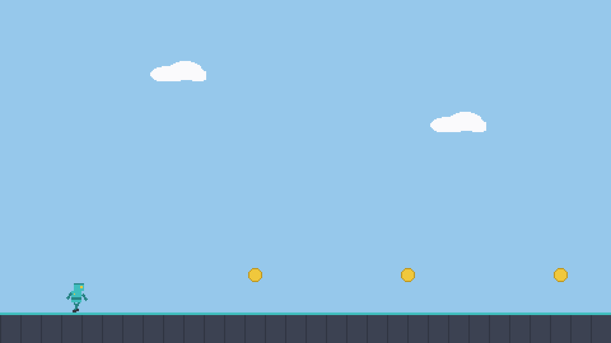

# sprite-runner — sprite atlas + animation (sokol)

Showcase game for [labelle-toolkit#611](https://github.com/labelle-toolkit/labelle-assembler/issues/611)
(`docs/showcase-plan.md`, row 7). A robot jogs across a scrolling ground
strip, collecting spinning coins under drifting clouds.



> Deterministic still of the authored scene (real `runner` atlas frames).
> Capture the true engine frame with the **Screenshot** command below.

## What it demonstrates

The engine's TWO animation tiers, side by side, both fed from one atlas:

- **`AnimationDef`** — the comptime character rig. `animations/runner.zon`
  compiles into a precomputed clip×variant sprite-name table; the run
  script plays the `run` clip by indexing the table
  (`RunnerAnim.spriteName(.run, .bot, frame)` → `run/bot_0001.png` …
  `run/bot_0006.png`, the atlas naming convention the def expects). No
  per-frame allocation, no name buffer.
- **`SpriteAnimation`** — the declarative one-clip primitive for
  everything else. The coins' 4-frame spin is attached ONCE as data
  (`SpriteAnimation{ .frames = &COIN_FRAMES, .fps = 10 }`) and advanced by
  the **engine** (`setDriveSpriteAnimations(true)`), so the game never
  touches their frames again.

Plus a small gameplay loop: the bot moves + wraps, coin overlap bumps the
score and respawns the coin ahead, clouds parallax-drift.

Files:

- `animations/runner.zon` — the `AnimationDef` rig (`idle` + `run` clips).
- `components/{runner,coin,cloud}.zig` — gameplay tags; `sprite_animation.zig`
  re-exports the engine component into the registry.
- `scripts/playing/10_run.zig` — both animation tiers + the loop.
- `assets/runner.{png,json}` — the single atlas (run frames, idle, coin
  spin, cloud, ground).

## Version pins — the released path & the sokol caveat

The showcase games pin the **released** package set (see the released-path
note in `tile-explorer/README.md`):

```zig
.core_version = "1.26.0", .engine_version = "2.6.0", .gfx_version = "1.28.1",
.labelle_version = "1.58.0", .assembler_version = "0.94.0",
.backend_package = .{ .name = "sokol", … .version = "0.5.0" },
```

**Caveat (assembler#611):** released assembler `0.94.0` does NOT build
this game on **sokol desktop**. The gfx#305 material seam gave the sokol
backend's gfx module a direct `labelle-core` import, and 0.94.0's
sokol-desktop byte-anchor codegen never unified it onto the app core — so
the two core instances yield distinct `MaterialEffect` types and sema
fails (`expected MaterialEffect, found MaterialEffect`). **This PR fixes
that** (the byte-anchor now unrolls the `backend_gfx` core-diamond edge,
matching the generic desktop path bgfx/raylib already use); the game
builds on the fixed assembler and on the next release carrying it. bgfx
and raylib were never affected (they take the generic `unifyCoreDiamond`
walk).

## Build & run

```bash
labelle build          # generate → zig build (needs the #611 assembler fix on sokol)
labelle run --timeout=20s
```

## Screenshot

```bash
labelle run --timeout=15s --screenshot=shot.bmp --after=3s
```

sokol writes a 24-bit BMP; it is the one backend with a true surfaceless
(no-GUI-session) capture path, so it is the natural CI screenshot target
once headless capture is wired for the generated game.
