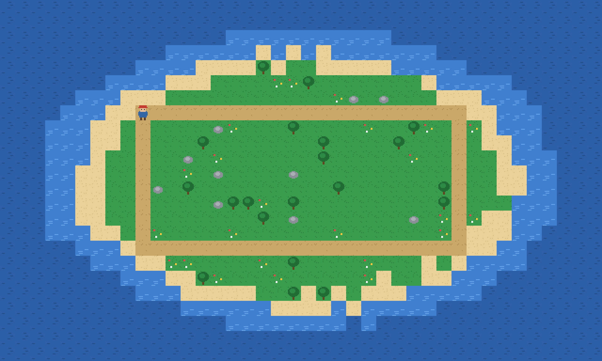

# tile-explorer — `.tmx` tilemap + camera follow (raylib)

Showcase game for [labelle-toolkit#611](https://github.com/labelle-toolkit/labelle-assembler/issues/611)
(the remaining games from `docs/showcase-plan.md`, row 8). An explorer
walks a path loop around a procedurally-authored island while a follow
camera tracks it, clamped to the map edges.



> The image is a deterministic still of the authored scene (the real
> `island.tmx` layers + explorer sprite). Capture the true engine frame
> with the command under **Screenshot** below.

## What it demonstrates

The cell no other showcase game covers — the engine BUILT-IN `Tilemap`
component (T2 Phase 4, engine#560) rendered through the camera:

- **Embedded `.tmx` tilemap** — `assets/island.tmx` (an orthogonal map,
  16 px tiles, an inline tileset, two CSV layers `ground` + `decor`) is
  `@embedFile`d at build time. The scene declares it with one built-in
  component, no `components/` file and no registry entry:
  `"Tilemap": { "asset_name": "island" }`.
- **Camera-prefabs seed** (engine#714) — the explorer carries the
  built-in `Camera` component (`"Camera": { "zoom": 2.0 }`), which seeds
  the view once on load; the gameplay script drives the per-frame follow
  (`getCamera().setPosition`, clamped to the map) — the RFC's "soft
  ownership".
- **Tilemap ↔ sprite share one transform** — the tile layers draw under
  the sprite pass through the same camera, so panning moves both together.

Files:

- `scenes/main.jsonc` — the terrain entity (`Tilemap`) + the explorer
  (`Sprite` + `Camera` + `Explorer`).
- `components/explorer.zig` — `Explorer { speed, waypoint }`.
- `scripts/playing/10_explore.zig` — path-loop walk + clamped camera follow.
- `assets/island.tmx` + `tileset.png` — the embedded map and its tiles.

## Version pins — the released path

Unlike the in-tree fixture examples (which pin `local:` sibling checkouts
to gate assembler HEAD), the showcase games pin the **released** package
set — they exist to prove the released path end-to-end (the `cli#322`
lesson: local-override tests hide released-path rot):

```zig
.core_version = "1.26.0", .engine_version = "2.6.0", .gfx_version = "1.28.1",
.labelle_version = "1.58.0", .assembler_version = "0.94.0",
```

The backend resolves through the `.raylib` enum shorthand to the current
`labelle-raylib` release.

## Build & run

```bash
labelle build          # generate → zig build, on the released pins above
labelle run --timeout=20s
```

## Screenshot

The generated `main.zig` honours `LABELLE_SCREENSHOT_PATH` (set by the
CLI's `--screenshot`), capturing one frame then continuing:

```bash
labelle run --timeout=15s --screenshot=shot.png --after=4s
```

raylib picks PNG/BMP by extension. (Windowed backends need a display /
GUI session; on a headless CI runner drive it under `xvfb`.)
